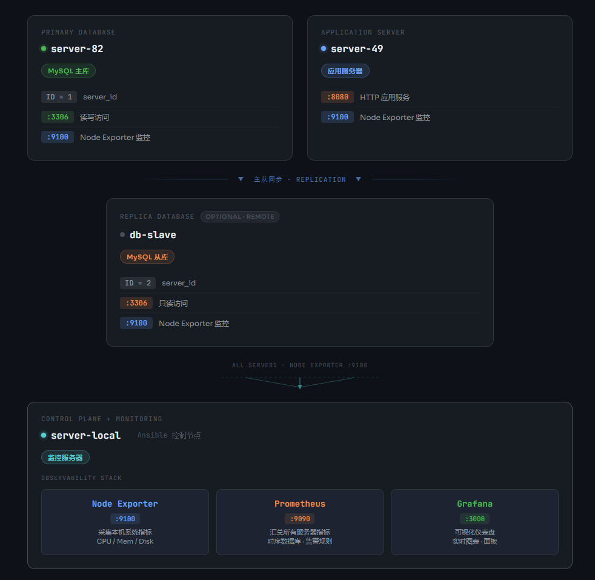

# 🚀 Ansible 自动化运维项目

基于 Ansible 实现的自动化运维脚本，覆盖服务器基础配置、MySQL 主从部署、全栈监控体系（Node Exporter + Prometheus + Grafana）的自动化部署与管理。

---

## 📋 目录

- [架构概览](#架构概览)
- [目录结构](#目录结构)
- [环境要求](#环境要求)
- [快速开始](#快速开始)
- [Vault 敏感信息管理](#vault-敏感信息管理)
- [Inventory 说明](#inventory-说明)
- [Role 说明](#role-说明)
- [部署指南](#部署指南)
- [常用操作](#常用操作)
- [常见问题](#常见问题)

---

## 架构概览


---

## 目录结构

```
ansible-playbooks/
│
├── ansible.cfg                     # Ansible 全局配置
├── .gitignore                      # Git 忽略规则（保护敏感文件）
├── README.md                       # 项目说明文档
│
├── inventory/
│   └── production.yml              # 生产环境主机清单
│
├── group_vars/
│   └── all/
│       ├── vars.yml                # 公用变量（可上传 GitHub）
│       └── vault.yml               # 加密的敏感变量（可上传 GitHub）
│
├── host_vars/
│   ├── server-82.yml               # MySQL 主库专属配置
│   ├── server-49.yml               # 应用服务器专属配置
│   ├── server-local.yml            # 监控服务器专属配置
│   └── db-slave.yml                # MySQL 从库专属配置（可选）
│
├── roles/
│   ├── base/                       # 系统基础配置 Role
│   │   ├── tasks/main.yml          # 主机名、时区、NTP、用户、防火墙
│   │   ├── handlers/main.yml
│   │   └── defaults/main.yml
│   │
│   ├── mysql/                      # MySQL 部署 Role
│   │   ├── tasks/main.yml          # 安装、配置、主从复制
│   │   ├── handlers/main.yml
│   │   ├── defaults/main.yml
│   │   └── templates/
│   │       ├── my.cnf.j2           # MySQL 配置模板（自动区分主从）
│   │       └── my_client.cnf.j2    # root 免密登录配置
│   │
│   └── monitoring/                 # 监控 Role
│       ├── tasks/main.yml          # Node Exporter + Prometheus + Grafana
│       ├── handlers/main.yml
│       ├── defaults/main.yml
│       └── templates/
│           ├── node_exporter.service.j2    # Node Exporter systemd 服务
│           ├── prometheus.service.j2       # Prometheus systemd 服务
│           ├── prometheus.yml.j2           # Prometheus 抓取配置（自动生成）
│           └── grafana_datasource.yml.j2   # Grafana 数据源（自动关联）
│
└── playbooks/
    ├── setup-base.yml              # 执行 base Role
    ├── setup-mysql.yml             # 执行 mysql Role
    ├── setup-monitoring.yml        # 执行 monitoring Role
    ├── install-tools.yml           # 批量安装工具（独立任务）
    ├── config-system.yml           # 系统配置（独立任务）
    └── test.yml                    # 连通性测试
```

---

## 环境要求

### 控制节点（server-local，本机）

| 软件 | 版本要求 |
|------|---------|
| Python | >= 3.8 |
| Ansible | >= 2.12 |
| 操作系统 | Ubuntu 20.04 / 22.04 |

```bash
# 安装 Ansible
apt update && apt install ansible -y

# 验证版本
ansible --version
```

### 被管节点（所有服务器）

| 要求 | 说明 |
|------|------|
| 操作系统 | Ubuntu 20.04 / 22.04 |
| SSH 访问 | 控制节点能 SSH 到被管节点 |
| Python | >= 3.6（大多数 Ubuntu 已预装）|
| 权限 | root 或具有 sudo 权限的用户 |

---

## 快速开始

### 第一步：克隆项目

```bash
git clone <your-repo-url>
cd ansible-playbooks
```

### 第二步：创建 Vault 密码文件

> ⚠️ 此文件已加入 `.gitignore`，**绝对不能上传到 GitHub！**

```bash
# 创建本地 Vault 密码文件
echo "你的Vault密码" > .vault_pass
chmod 600 .vault_pass
```

### 第三步：初始化敏感变量

```bash
# 解密并编辑 vault.yml，填入真实密码
ansible-vault edit group_vars/all/vault.yml
```

`vault.yml` 内容格式：

```yaml
vault_mysql_root_password: "你的MySQL_root密码"
vault_mysql_repl_password: "你的主从复制密码"
vault_grafana_admin_password: "你的Grafana管理员密码"
```

### 第四步：配置服务器 IP

编辑 `inventory/production.yml`，填入真实 IP 地址：

```yaml
db_servers:
  hosts:
    server-82:
      ansible_host: 你的MySQL主库IP
```

### 第五步：测试连通性

```bash
ansible all -m ping
```

预期输出：

```
server-82    | SUCCESS => {"ping": "pong"}
server-49    | SUCCESS => {"ping": "pong"}
server-local | SUCCESS => {"ping": "pong"}
```

### 第六步：按顺序部署

```bash
# 1. 基础配置
ansible-playbook playbooks/setup-base.yml

# 2. MySQL 部署
ansible-playbook playbooks/setup-mysql.yml

# 3. 监控部署
ansible-playbook playbooks/setup-monitoring.yml
```

---

## Vault 敏感信息管理

项目使用 **Ansible Vault** 加密所有敏感信息，加密后的文件可以安全上传到 GitHub。

### 文件说明

| 文件 | 能否上传 GitHub | 说明 |
|------|:------------:|------|
| `group_vars/all/vault.yml` | ✅ 可以 | 内容已 AES-256 加密 |
| `group_vars/all/vars.yml` | ✅ 可以 | 无任何敏感信息 |
| `host_vars/*.yml` | ✅ 可以 | 无任何敏感信息 |
| `.vault_pass` | ❌ 绝对不行 | 已加入 `.gitignore` |

### 常用 Vault 命令

```bash
# 加密文件
ansible-vault encrypt group_vars/all/vault.yml

# 查看加密文件内容
ansible-vault view group_vars/all/vault.yml

# 编辑加密文件
ansible-vault edit group_vars/all/vault.yml

# 重新加密（更换密码）
ansible-vault rekey group_vars/all/vault.yml

# 临时解密（不推荐长期使用）
ansible-vault decrypt group_vars/all/vault.yml
```

### 团队协作说明

```
新成员加入项目时：
1. 克隆 GitHub 仓库（vault.yml 已加密，安全）
2. 向管理员获取 Vault 密码
3. 创建本地 .vault_pass 文件
4. 正常使用，无需其他操作
```

---

## Inventory 说明

### 主机分组结构

```
all
└── production（生产环境父组）
    ├── db_servers（数据库服务器）
    │   ├── server-82      MySQL 主库
    │   └── db-slave       MySQL 从库（可选）
    ├── app_servers（应用服务器）
    │   └── server-49
    └── monitoring（监控服务器）
        └── server-local   本机，Ansible 控制节点
```

### 启用 MySQL 从库

当你有第二台数据库服务器时，编辑 `inventory/production.yml`，取消注释从库配置：

```yaml
db_servers:
  hosts:
    server-82:
      ansible_host: 主库IP
      server_role: master_db
      mysql_server_id: 1

    db-slave:                        # 取消注释这一段
      ansible_host: 从库真实IP        # 填入从库 IP
      server_role: slave_db
      mysql_server_id: 2
      mysql_master_host: 主库IP       # 填入主库 IP
```

同时确认 `host_vars/db-slave.yml` 配置正确：

```yaml
server_role: slave_db
mysql_server_id: 2
mysql_master_host: 主库IP
```

---

## Role 说明

### base Role——系统基础配置

**用途：** 所有服务器上线后的第一步初始化

**功能列表：**

| 功能 | 说明 |
|------|------|
| 设置主机名 | 使用 `inventory_hostname` 自动设置 |
| 设置时区 | 默认 `Asia/Shanghai`，可通过变量修改 |
| NTP 时间同步 | 安装 chrony，使用阿里云 NTP 服务器 |
| 创建运维用户 | 创建 `ops` 用户，配置 sudo 免密 |
| 安装基础工具 | vim、wget、curl、htop、net-tools 等 |
| 配置防火墙 | firewalld，默认开放 SSH、HTTP、HTTPS |

**可配置变量（`roles/base/defaults/main.yml`）：**

```yaml
timezone: Asia/Shanghai         # 时区
ops_user: ops                   # 运维用户名
ssh_port: 22                    # SSH 端口
base_packages:                  # 基础工具包列表
  - vim
  - wget
  - curl
  - htop
  - net-tools
ntp_servers:                    # NTP 服务器
  - ntp.aliyun.com
```

---

### mysql Role——MySQL 部署

**用途：** 自动部署 MySQL，支持主库、从库，自动配置主从复制

**功能列表：**

| 功能 | 说明 |
|------|------|
| 安装 MySQL | 自动安装 mysql-server 及依赖 |
| 自动区分主从 | 根据 `server_role` 变量生成对应配置 |
| 主库配置 | 开启 binlog、设置 server-id |
| 从库配置 | 开启 relay log、设置只读模式 |
| 主从复制 | 自动配置 CHANGE PRIMARY TO，一键完成 |
| 幂等保护 | 已在同步的从库不会被重复配置 |
| 安全初始化 | 删除匿名用户、删除测试库 |

**主从角色通过 host_vars 区分：**

```yaml
# host_vars/server-82.yml（主库）
server_role: master_db
mysql_server_id: 1

# host_vars/db-slave.yml（从库）
server_role: slave_db
mysql_server_id: 2
mysql_master_host: 主库IP
```

**可配置变量（`roles/mysql/defaults/main.yml`）：**

```yaml
mysql_port: 3306
mysql_bind_address: "0.0.0.0"
mysql_max_connections: 200
mysql_character_set: utf8mb4
mysql_slow_query_log: 1
mysql_slow_query_time: 2
```

**密码变量（在 `vault.yml` 中加密存储）：**

```yaml
vault_mysql_root_password: "..."
vault_mysql_repl_password: "..."
```

---

### monitoring Role——监控体系部署

**用途：** 部署完整的 Prometheus 监控栈

**部署策略：**

```
所有服务器（all）：
  └── Node Exporter（:9100）   采集本机系统指标

仅监控服务器（monitoring 组）：
  ├── Prometheus（:9090）       汇总所有服务器的指标数据
  └── Grafana（:3000）          可视化展示仪表盘
```

**功能列表：**

| 组件 | 功能 |
|------|------|
| Node Exporter | 采集 CPU、内存、磁盘、网络等系统指标 |
| Prometheus | 定时抓取所有 Node Exporter 数据并存储 |
| Grafana | 可视化仪表盘，自动关联 Prometheus 数据源 |

**Prometheus 自动发现：** 无需手动配置抓取目标，模板会自动读取 `inventory` 里的所有主机，新增服务器后重新执行 playbook 即可自动纳入监控。

**访问地址（部署完成后）：**

| 服务 | 地址 | 说明 |
|------|------|------|
| Node Exporter | `http://服务器IP:9100/metrics` | 原始指标数据 |
| Prometheus | `http://监控服务器IP:9090` | 数据查询界面 |
| Grafana | `http://监控服务器IP:3000` | 可视化仪表盘 |

**可配置变量（`roles/monitoring/defaults/main.yml`）：**

```yaml
node_exporter_version: "1.7.0"
prometheus_version: "2.51.0"
node_exporter_port: 9100
prometheus_port: 9090
grafana_port: 3000
prometheus_scrape_interval: 15s    # 抓取频率
```

**密码变量（在 `vault.yml` 中加密存储）：**

```yaml
vault_grafana_admin_password: "..."
```

---

## 部署指南

### 完整首次部署流程

```bash
# ── 第一步：基础配置（所有服务器）──────────────────
ansible-playbook playbooks/setup-base.yml

# ── 第二步：MySQL 部署（数据库服务器）──────────────
# 先部署主库
ansible-playbook playbooks/setup-mysql.yml --limit server-82

# 再部署从库（如果有）
ansible-playbook playbooks/setup-mysql.yml --limit db-slave

# ── 第三步：监控部署 ────────────────────────────────
# Node Exporter 部署到所有服务器
# Prometheus + Grafana 只装在 monitoring 组
ansible-playbook playbooks/setup-monitoring.yml
```

### 常见场景操作

```bash
# 只更新 MySQL 配置文件，不重装
ansible-playbook playbooks/setup-mysql.yml --tags "config"

# 只重启某个服务
ansible db_servers -m systemd -a "name=mysql state=restarted" --become

# 新增一台服务器，只对它执行初始化
ansible-playbook playbooks/setup-base.yml --limit 新服务器名

# 更新 Prometheus 配置（新增了服务器后）
ansible-playbook playbooks/setup-monitoring.yml --limit server-local
```

### 验证部署结果

```bash
# 验证所有服务器连通性
ansible all -m ping

# 验证 MySQL 主从状态（在从库执行）
ansible db_servers -m shell \
  -a "mysql -e 'SHOW REPLICA STATUS\G' 2>/dev/null | grep -E 'Running|Behind'" \
  --become

# 验证 Node Exporter 运行状态
ansible all -m uri \
  -a "url=http://localhost:9100/metrics status_code=200"

# 验证 Prometheus 健康状态
ansible monitoring -m uri \
  -a "url=http://localhost:9090/-/healthy status_code=200"
```

---

## 常用操作

### Ad-hoc 快速命令

```bash
# 查看所有服务器系统信息
ansible all -m setup -a "filter=ansible_distribution*"

# 查看磁盘使用情况
ansible all -m shell -a "df -h"

# 查看内存使用情况
ansible all -m shell -a "free -h"

# 批量重启服务
ansible webservers -m systemd -a "name=nginx state=restarted" --become

# 查看服务状态
ansible all -m shell -a "systemctl status node_exporter" --become
```

### Playbook 执行选项

```bash
# 语法检查（不执行）
ansible-playbook playbooks/setup-base.yml --syntax-check

# 演习模式（预览会做什么，不真正执行）
ansible-playbook playbooks/setup-base.yml --check

# 详细输出（排错用）
ansible-playbook playbooks/setup-base.yml -v
ansible-playbook playbooks/setup-base.yml -vvv   # 最详细

# 只对指定主机执行
ansible-playbook playbooks/setup-base.yml --limit server-82

# 从指定任务开始执行（跳过前面的）
ansible-playbook playbooks/setup-mysql.yml --start-at-task "启动 MySQL 服务"

# 临时覆盖变量
ansible-playbook playbooks/setup-mysql.yml -e "mysql_max_connections=500"
```

---

## 常见问题

**Q：执行 playbook 提示找不到 Role？**

```
ERROR! the role 'base' was not found
```

检查 `ansible.cfg` 中的 `roles_path` 是否正确：

```ini
roles_path = /root/ansible-playbooks/roles
```

---

**Q：Vault 相关报错？**

```
ERROR! Attempting to decrypt but no vault secrets found
```

确认 `.vault_pass` 文件存在且内容正确：

```bash
ls -la .vault_pass          # 确认文件存在
cat .vault_pass             # 确认密码内容
```

---

**Q：MySQL 主从复制配置失败？**

确认执行顺序正确——**必须先部署主库，再部署从库**：

```bash
# 正确顺序
ansible-playbook playbooks/setup-mysql.yml --limit server-82    # 先主库
ansible-playbook playbooks/setup-mysql.yml --limit db-slave     # 再从库
```

---

**Q：Grafana 无法访问？**

```bash
# 检查服务状态
systemctl status grafana-server

# 检查端口是否监听
ss -tlnp | grep 3000

# 检查防火墙规则
firewall-cmd --list-ports
```

---

**Q：Prometheus 抓取不到某台服务器的数据？**

```bash
# 确认 Node Exporter 在目标服务器上正常运行
curl http://目标服务器IP:9100/metrics

# 确认防火墙已开放 9100 端口
ansible 目标服务器 -m shell -a "firewall-cmd --list-ports" --become
```

---

## 项目信息

- **Ansible 版本**：>= 2.12
- **目标系统**：Ubuntu 20.04 / 22.04
- **Node Exporter 版本**：1.7.0
- **Prometheus 版本**：2.51.0
